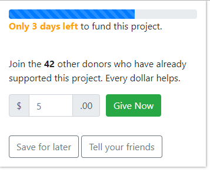

# Coding challenge

This repository contains a task, which I implemented as a coding challenge for the interview. You can find the description of the task below.

## Conditions

I had to implement a small form.

## Result

This is the final result, which took me about 1 hour to implement (with additional work of setting up the project and repository).



## Getting Started

These instructions will get you a copy of the project up and running on your local machine for development and testing purposes.

### Prerequisites

Before you can run the application, you have to go through the following steps of installing the pre-requisites.

### Install npm

To run this project, you will need to install `npm`. It goes together with `Nodejs`. Therefore, download and install `node` from [here](https://nodejs.org/en/).

After you did install node, to check whether you have it, run the following commands in the console.

##### To check if you have `Node.js` installed, run this command in your terminal:

`node -v`

##### To confirm that you have `npm` installed you can run this command in your terminal:

`npm -v`

## Install packages

Now, once you installed `npm`, under the root directory, run the following command to install all required packages to run the application.

```
npm i
```

## Building

The application is already built and is ready to run. Therefore, you can skip this step. However, in case you want to re-build the project, run the following command:
`gulp dist`.

Afterwards, the fresh version will appear under the `dist` directory.

## Running

Now you can run the actual project. As it is under `gulp`, the latest build is located in the directory `dist`. Therefore, you will have to start up a simple HTTP server to serve up the site files on your local computer.

##### First option:
You can either select a server of your own, or just run the following command:

`npm start`.

It will run an http-server available at `http://localhost:8000`, which is configured by `http-server` package.

##### Second option:

If you are using `vscode`, this plugin might be helpful:
`https://github.com/ritwickdey/vscode-live-server`

However, you can do it in any other way.

## Built With

- [Gulp](https://gulpjs.com/) - gulp is a toolkit for automating painful or time-consuming tasks in your development.
- [SASS](https://sass-lang.com/) - Sass is the most mature, stable, and powerful professional grade CSS extension language in the world.
- [jQuery](http://jquery.com/) - jQuery is a fast, small, and feature-rich JavaScript library. It makes things like HTML document traversal and manipulation, event handling, animation, and Ajax much simpler.
- [Bootstrap](https://getbootstrap.com/) - Bootstrap is an open source toolkit for developing with HTML, CSS, and JS.